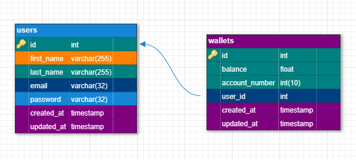

# Demo Credit

## What is Demo Credit?

`Demo credit` is a mobile lending application that allows users to receive loans and make repayments for the loans. The `Demo Credit Wallet` is an MVP that allows users to access wallet functionalities such as:

- Signing up and login functionality
- Funding wallet
- Transfering funds to other users
- Withdrawing funds

## Tech Stack

- Node.js (LTS Version)
- TypeScript
- KnexJS ORM
- MySQL Database

## Getting Started

- Clone this repository: `git clone https://github.com/AdeGneus/demo-credit-wallet.git`
- Cd into the project directory: `cd demo-credit-wallet`
- Install packages using your package manager e.g `npm install`
- The project uses some environment variables for its configuration. The environnment variables that are required can be found at [default.ts in config directory](./config/default.ts)
- Access and refresh tokens are used for authentication and they are base64 encoded. To set yours, if you have open-ssl installed on your PC, you can do the following in your terminal

  - Generate private key: `openssl genrsa -out privkey.pem 2048`
  - Generate public key: `openssl rsa -in privkey.pem -pubout -out pubkey.pem`
  - Base64 encode the private key: `cat privkey.pem | base64 > priv`
  - Base64 encode the public key: `cat pubkey.pem | base64 > pub`

  - Copy the content of the priv (for access token private key) and pub (for access token public key) file without trailing spaces to your `.env` file.

  - Repeat the process to generate for refresh tokens

  - Alternatively, you can use [this site](https://travistidwell.com/jsencrypt/demo/) to generate public and private keys (ensure that you choose 2048 bit) and use [this](https://www.base64encode.org/) to base64 encode them

- The API uses versioning, you can set `API_PREFIX` in the `.env` file to `"api/v1"`
- Once you set up the environment variables, proceed to creating a MySQL database for testing in development mode. Copy your database connection details to the `.env` file
- Run the migrations for your database using `npm run migrate` you can also seed it with dummy data using `npm run seed`
- Start the development server using `npm run dev`. You should see something like this `[12:45:19.000] INFO: App is listening at http://localhost:8000` printed to your console
- You can make request using postman to `http://localhost:8000/api/v1/auth/signup` to create a user. Alternatively you can use the postman collection json file

## API Documentation

You can read the documentation on how to make use of the API [here](https://documenter.getpostman.com/view/16460234/2s9YJW5REH)

## Database Schema

The E-R (Entity Relationship) diagram can be visualized below


The user_id column in the wallets table references the user (owner) of the wallet

## Project Structure

```bash
demo-credit-wallet/
    ├── config/
    | ├── default.ts                # Configuration file for setting environment variables
    ├── src/
    | ├── app.ts                    # Express file for handling requests
    | ├── controllers/              # Called by routers for providing access to resources
    | | ├── auth.controller.ts
    | | ├── wallet.controller.ts
    | ├── routes/                   # API route handlers
    | | ├── index.routes.ts
    | ├── services/                 # Called by controllers to get resources from database
    | | ├── user.service.ts
    | | ├── wallet.service.ts
    | ├── db/
    | | ├── migrations/             # Database migration files
    | | ├── seeds/                  # Database seeding files
    | | ├── db.ts                   # Database configuration file based on current environment
    | ├── ...
    ├── index.ts                    # Listening for requests
    ├── knexfile.ts                 # Database configuration
    ├── package.json                # Node.js project configuration
    ├── README.md                   # README design document
    ├── tsconfig.json               # TypeScript configuration
```

## Security Considerations

- I used the argon2 library for encrypting passwords as it is more secure than the bcrypt library
- Tokens are used for authenticating users. They are base64 2048 bit encoded to ensure secure authentication
- Some further security measures like checking if a user recently changed password before logging in to prevent against breach of access can be implemented as this is an MVP

## Test

The test suite was setup using Jest, Supertest and ts-test

## Deployment

The current API is deployed [here](https://wasiu-bakare-lendsqr-be-test.onrender.com)

The documentation of the approach I used can be found [here](https://docs.google.com/document/d/1WDgcMNW3NrCMn0Ndbek1B-y-siTzWw3Q4nyN68nKonA/edit?usp=sharing)
